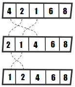
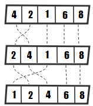

## 99. 배열정렬  

```java  
int[] integers = new int[] {1,2,3,6,5};  
Arrays.sort(integers);  //퀵정렬  
```  
  
### 버블정렬  
  
  
  
* 앞에 있는 값을 뒤에 있는 값과 비교하면서 크면 뒤로 이동시킨다.   
* 시간 복잡도의 경우는 다음과 같습니다 : best case O(n), average case 및 최악의 경우 O(n<sup>2</sup>), O(n<sup>2</sup>)  
* 공간 복잡성 사례는 다음과 같습니다. 최악의 경우 O(1)  
  
```java  
public static void bubbleSort(int[] arr) {  
	int n = arr.length;  
	for (int i = 0; i < n - 1; i++) {  
		for (int j = 0; j < n - i - 1; j++) {  
			if (arr[j] > arr[j + 1]) {  
				int temp = arr[j];  
				arr[j] = arr[j + 1];  
				arr[j + 1] = temp;  
			}  
		}  
	}  
}  
```

```java
public static <T> void bubbleSortWithComparator(
    T arr[], Comparator<? super T> c) {

  int n = arr.length;

  for (int i = 0; i < n - 1; i++) {
    for (int j = 0; j < n - i - 1; j++) {

      if (c.compare(arr[j], arr[j + 1]) > 0) {
        T temp = arr[j];
        arr[j] = arr[j + 1];
        arr[j + 1] = temp;
      }
    }
  }
}

public class MelonComparator implements Comparator<Melon> {

  @Override
  public int compare(Melon o1, Melon o2) {
    return o1.getType().compareTo(o2.getType());
  }
}

// Ascending
Comparator<Melon> byType = Comparator.comparing(Melon::getType);

// Descending
Comparator<Melon> byType 
  = Comparator.comparing(Melon::getType).reversed();
```


### 삽입정렬



두번째부터 시작해서 이전요소와 비교, 이전요소가 크면 교체한다. 이전요소가 현재요소보다 작으면 다음요소로 넘어간다.

* 시간 복잡도의 경우는 다음과 같습니다 : 최상의 경우 O(n), 평균적인 경우 , 최악의 경우O(n<sup>2</sup>)O(n<sup>2</sup>)
* 공간 복잡성 사례는 다음과 같습니다 . 최악의 경우O(1)

```java
public static void insertionSort(int arr[]) {
  int n = arr.length;

  for (int i = 1; i < n; ++i) {	// 두번째 요소 부터 시작
    int key = arr[i];
    int j = i - 1;

    while (j >= 0 && arr[j] > key) {	// 이전요소가 현재요소보다 클 경우
      arr[j + 1] = arr[j];
      j = j - 1;
    }

    arr[j + 1] = key;
  }
}
```

```java
public static <T> void insertionSortWithComparator(
  T arr[], Comparator<? super T> c) {

  int n = arr.length;

  for (int i = 1; i < n; ++i) {

    T key = arr[i];
    int j = i - 1;

    while (j >= 0 && c.compare(arr[j], key) > 0) {
      arr[j + 1] = arr[j];
      j = j - 1;
    }

    arr[j + 1] = key;
  }
}

Comparator<Melon> byType = Comparator.comparing(Melon::getType)
  .thenComparing(Melon::getWeight);
```