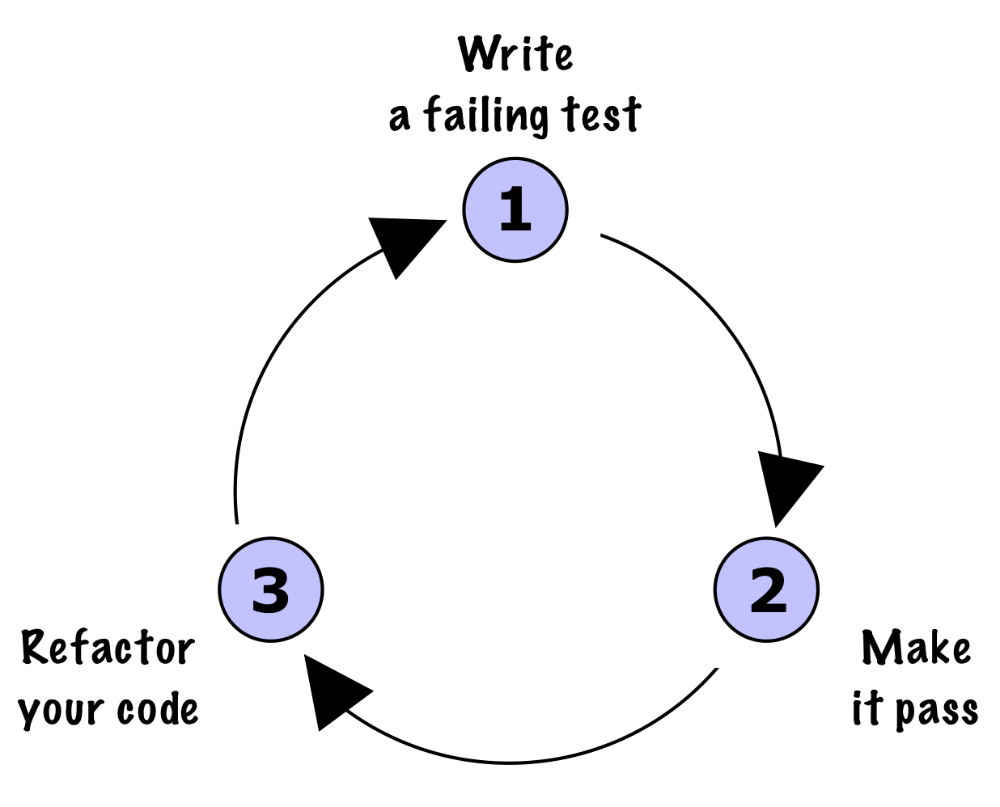
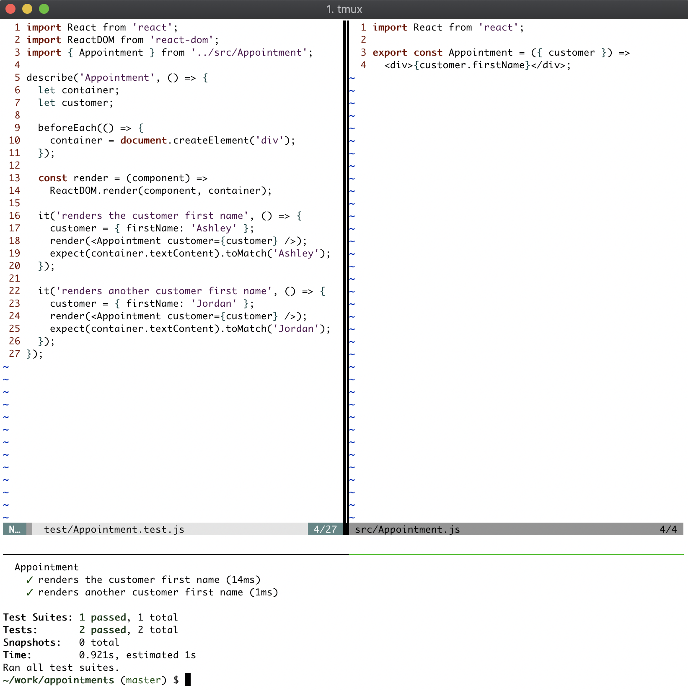

# Writing great tests

이제 첫 번째 테스트는 다음과 같다.

```javascript
it('renders the customer first name', () => {
  customer = { firstName: 'Ashley' };
  render(<Appointment customer={customer} />);
  expect(container.textContent).toMatch('Ashley');
});
```

This is concise and clearly readable.

A good test has three distinct sections:

* Arrange: Sets up test dependencies
* Act: Executes production code under test
* Assert: Checks expectations are met

A great test is not just good but is also the following:

* Short
* Descriptive
* Independent of other tests
* Has no side-effects

## Red, green, refactor

We’ve covered a lot of ground, and we have gone into excruciating detail for a very simple test. All of the ground work is now done for us to speed up.

Let's look at the red, green, refactor cycle:



The steps of the TDD cycle are as follows:

* Write a failing test: Write a short test that describes some functionality you want. Execute your test and watch it fail. If it doesn’t fail, then it's not a good test; go back and try again.
* Make it pass: Make the test green. Do the simplest thing that will work. Feel free to make a mess; you can clean it up later.
* Refactor your code: Stop, slow down, and resist the urge to move on to the next feature. Work hard to make your code—both production and test code—as clean as it can be.

## Streamlining your testing process

Think about the effort you've put into this book so far. What actions have you been doing the most? Most likely, you've been doing these:

* Switching betweensrc/Appointment.jsandtest/Appointment.test.js
* Runningnpm test

To solve the first issue, you should use split-screen functionality in your editor. If you aren't already using that, then take this opportunity to learn how to do it. Load your production module on one side and the corresponding unit test file on the other. Here's a picture of my setup:



You can see that I also have a little test window at the bottom for showing test output.

Jest can also watch your files and auto-run tests when they change. To enable this, change the test command in package.json to jest --watchAll. This reruns all of your tests when it detects any changes.

```
Note
Jest has an option to run only the tests in files that have changed, but you’ll find that since your React app will be composed of many different files, each of which is interconnected, it's better to run everything, as breakages can happen in many modules.
```