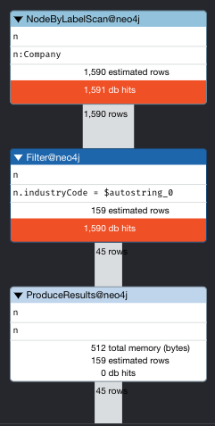
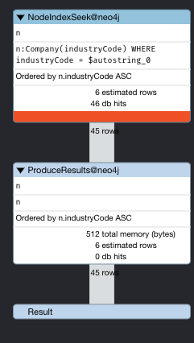
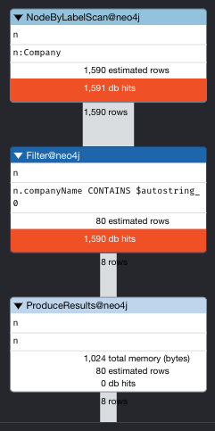

### 산업분류 코드로 검색

```sql
profile match (n:Company {industryCode: "G46739"}) return n;
EXPLAIN match (n:Company {industryCode: "G46739"}) return n;
CYPHER replan = force EXPLAIN match (n:Company {industryCode: "G46739"}) return n;
```


### 인덱스 추가
```sql
CREATE INDEX ON :Company(industryCode)d
```


### 기업 이름 검색

```sql
profile match (n:Company)
where n.companyName contains '삼성'
return n
```

```sql
match (n:Company)-[r:sell]->(n2:Company)
where n.companyName contains '삼성'
return n, r, n2
```

```sql
profile match (n:Company)-[r:sell]->(n2:Company)
match (n)-[r2:buy]->(n3:Company)
where n.companyName contains '삼성'
return n, r, n2, r2, n3
```


### 데이터 업데이트
```sql
MATCH (p:Person {name: 'Jennifer'})
SET p.birthdate = date('1980-01-01')
RETURN p
```